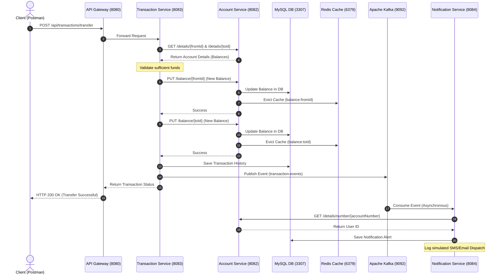

# 🏦 Personal Finance Management System

A high-performance, containerized, microservices-based **Personal Finance Management System** built with **Java 17**, **Spring Boot 3.x**, **Spring Cloud Gateway**, **Redis**, **Apache Kafka**, **Docker**, and **MySQL**.

---

## 🏗️ Architecture Overview

### System Topology
```
Client (Postman)
      │
      ▼
[API Gateway :8080]          ← Spring Cloud Gateway
      │
      ├──▶ [User Service :8081]         ← Auth, JWT, Redis token blacklist
      ├──▶ [Account Service :8082]      ← Accounts, Balance (Redis cache)
      ├──▶ [Transaction Service :8083]  ← Transfers, History → Kafka producer
      └──▶ [Notification Service :8084] ← Kafka consumer, logs alerts

Infrastructure (Docker):
  MySQL      :3307   ← Unified database for accounts, transactions, users, notifications
  Redis      :6379   ← Token blacklist, balance cache, and gateway rate limiting
  Kafka      :9092   ← Event-driven notification stream
  Zookeeper  :2181   ← Kafka configuration coordination
```

### 🔄 End-to-End Money Transfer Flow (Sequence Diagram)
This diagram illustrates the sequence of synchronous REST calls and asynchronous Kafka events triggered during a money transfer, along with Redis cache-invalidation:



---

## 🔑 Redis Usage Summary

| Feature | Service | Redis Key Pattern | TTL | Pattern |
|---|---|---|---|---|
| **JWT Blacklist** | User Service | `blacklist:{token}` | Remaining token life | Token Blacklist |
| **Balance Cache** | Account Service | `balance:{accountId}` | 5 minutes (300s) | Cache-Aside |
| **Rate Limiting** | API Gateway | `rate:ip:{ip}` | Dynamic | Token Bucket Rate Limiter |

---

## 📦 Services Directory

### 1. [API Gateway](./api-gateway) (:8080)
- Single entry point using **Spring Cloud Gateway**.
- Performs reactive routing to downstream microservices.
- Utilizes **Redis Token Bucket Rate Limiter** to limit active users `/api/users/login` endpoint to 5 attempts/minute from a single IP.

### 2. [User Service](./user-service) (:8081)
- Handles user registration (`POST /api/users/register`) and login (`POST /api/users/login`).
- Implements secure credential storage with **BCrypt password hashing**.
- Generates **256-bit secure JWT tokens**.
- Supports secure logout (`POST /api/users/logout`) which blacklists the active JWT inside Redis with dynamic TTL matching token expiration.

### 3. [Account Service](./account-service) (:8082)
- Manages user bank accounts (`POST /api/accounts`) and detailed user summaries.
- Features high-speed cash balances using **Cache-Aside Pattern in Redis** (`GET /api/accounts/balance/{accountId}`).
- Instantly invalidates/evicts balance caches upon balance adjustments (`PUT /api/accounts/balance/{accountId}`).

### 4. [Transaction Service](./transaction-service) (:8083)
- Orchestrates funds transfers between two accounts (`POST /api/transactions/transfer`).
- Verifies balance and details via REST calls to the Account Service.
- Publishes structured Kafka transaction events to the `transaction-events` topic upon success.
- Provides transaction histories (`GET /api/transactions/{accountId}`).

### 5. [Notification Service](./notification-service) (:8084)
- Uses a **Kafka Consumer** listening to the `transaction-events` topic.
- On receipt, queries the Account Service to find the associated User ID.
- Saves alerts to MySQL and logs notification outputs to mimic actual SMS/email dispatches.
- Exposes user dispatches via `GET /api/notifications/{userId}`.

---

## 🚀 Getting Started

### 📋 Prerequisites
- **Java 17 JDK**
- **Apache Maven 3.8+**
- **Docker & Docker Compose**

### 1. Start Infrastructure
Run the following from the root directory to spin up MySQL, Redis, Kafka, and Zookeeper:
```bash
docker-compose up -d
```

### 2. Build & Launch Services
Navigate to each service directory and execute:
```bash
mvn spring-boot:run
```

Execute them in the following suggested sequence:
1. **User Service** (:8081)
2. **Account Service** (:8082)
3. **Transaction Service** (:8083)
4. **Notification Service** (:8084)
5. **API Gateway** (:8080)

---

## 🧪 Testing Your APIs

You can perform testing directly using Postman:

1. **Register a User**:
   - `POST http://localhost:8080/api/users/register`
   - Body: `{"name": "John Doe", "email": "john@test.com", "password": "secure123Password"}`

2. **Login**:
   - `POST http://localhost:8080/api/users/login`
   - Body: `{"email": "john@test.com", "password": "secure123Password"}`
   - *Response returns JWT Token. Copy this token.*

3. **Get Profile (Auth Protected)**:
   - `GET http://localhost:8080/api/users/profile`
   - Header: `Authorization: Bearer <TOKEN>`

4. **Create Accounts**:
   - `POST http://localhost:8080/api/accounts`
   - Header: `Authorization: Bearer <TOKEN>`
   - Body: `{"userId": 1, "accountType": "SAVINGS"}`

5. **Get Balance (Checks Redis Cache)**:
   - `GET http://localhost:8080/api/accounts/balance/1`

6. **Deposit / Adjust Balance**:
   - `PUT http://localhost:8080/api/accounts/balance/1`
   - Body: `{"balance": 1000.00}`

7. **Transfer Money (Triggers Kafka notification events)**:
   - `POST http://localhost:8080/api/transactions/transfer`
   - Body: `{"fromAccountId": 1, "toAccountId": 2, "amount": 250.00, "description": "Gift to friend"}`

8. **View Notifications**:
   - `GET http://localhost:8080/api/notifications/1`
